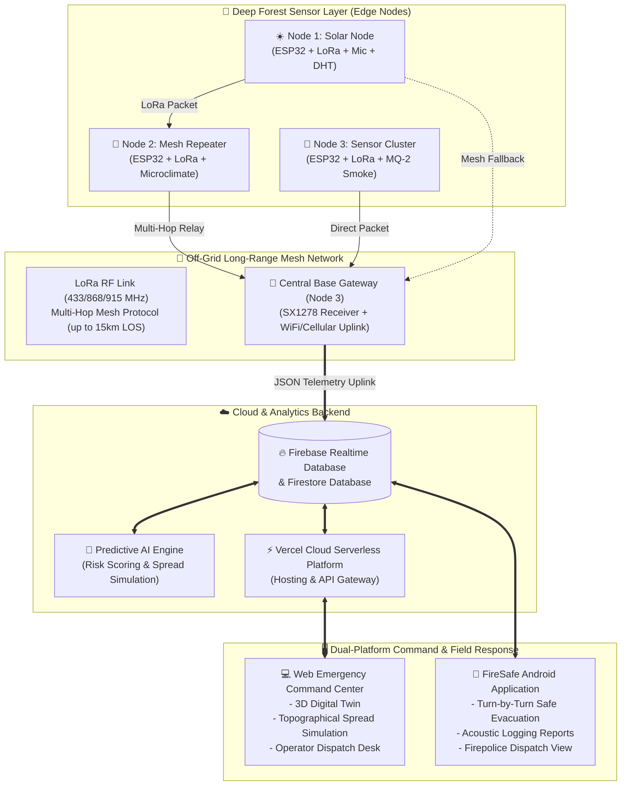
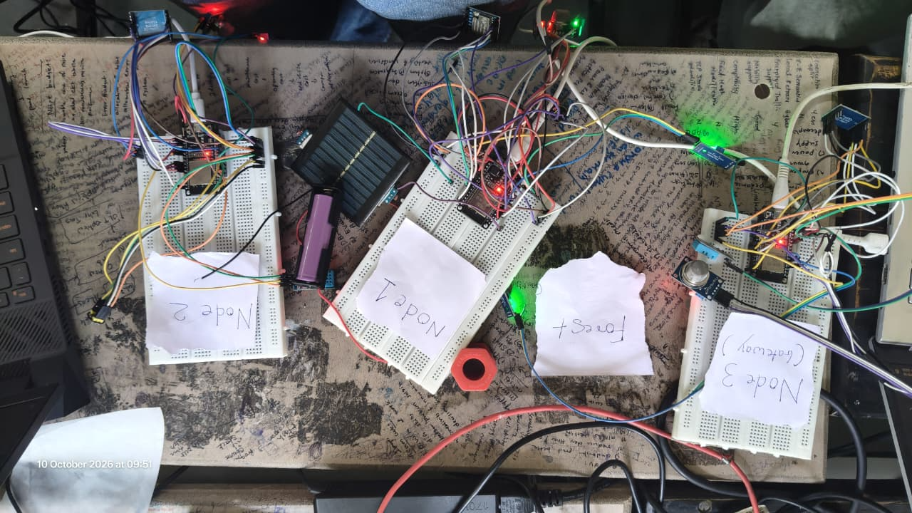
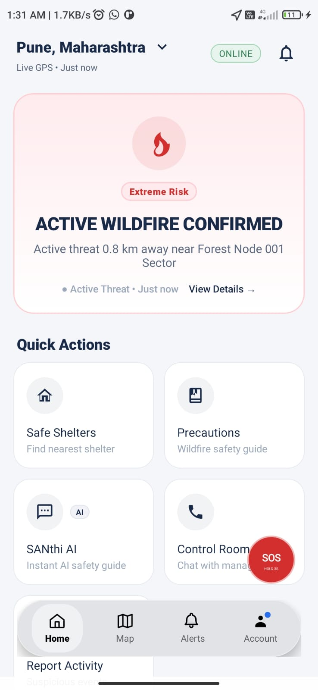
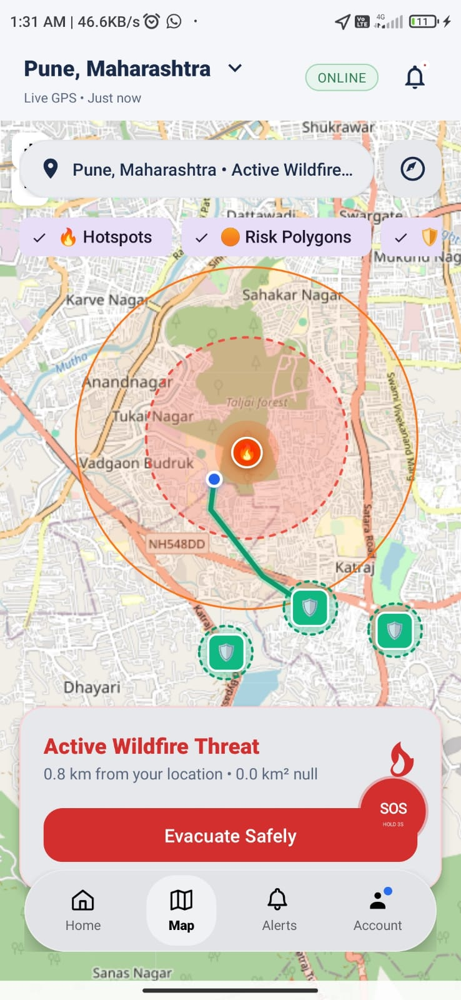
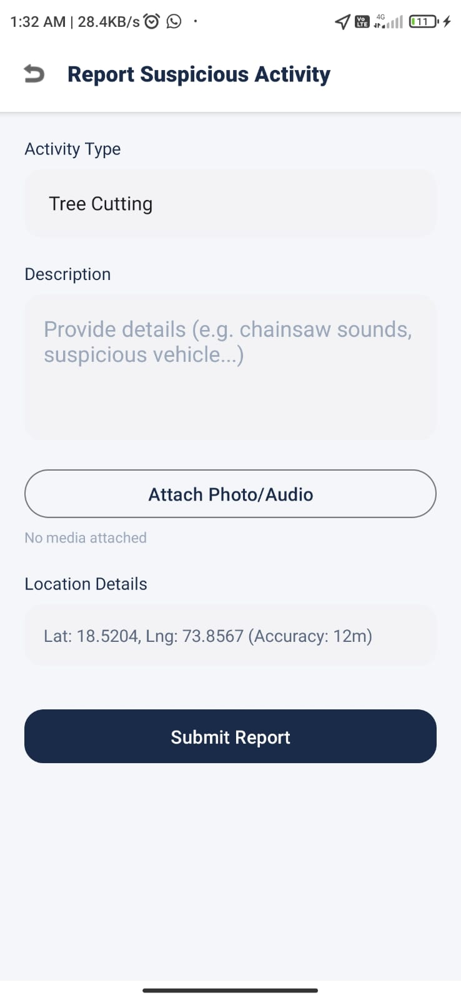
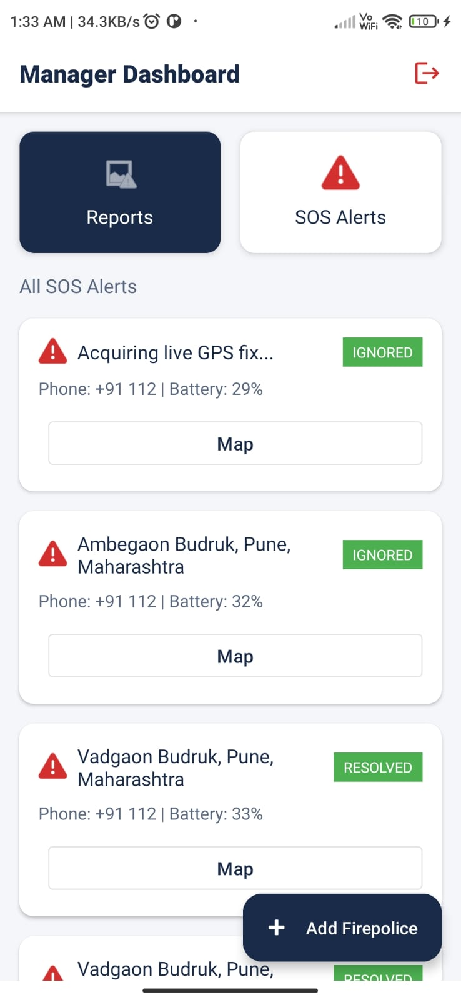
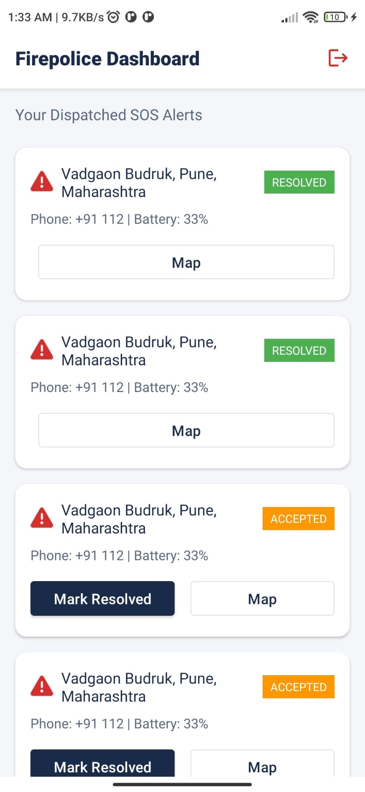

# 🌲🔥 FireSafe – Solar-Powered Long-Range Mesh Network for Forest Fire & Wildland Acoustic Infiltration

<p align="center">
  
</p>

<p align="center">
  
  
  
  
  
  
</p>

---

## 🌐 Quick Links & Live Demonstrations

<table align="center" width="100%">
  <tr>
    <td align="center" width="50%">
      <h3>🖥️ Web Command Center</h3>
      <p>Real-time 3D Digital Twin, GIS Simulation & Operator Dispatch</p>
      <a href="https://firesafeakatsuki.vercel.app/">
        
      </a>
    </td>
    <td align="center" width="50%">
      <h3>📱 Mobile Android Application</h3>
      <p>Citizen Evacuation Pathfinding, Field Reporting & Officer Dispatch</p>
      <a href="https://github.com/shampatil23/FireSafe_Akatsuki/releases/download/v1/FireSafe.apk">
        
      </a>
    </td>
  </tr>
</table>

---

## 🎯 Executive Overview & Hackathon Metadata

* **Hackathon**: **Fusion 2026**
* **Team Name**: **Akatsuki**
* **Team ID**: **FUS26-126**
* **Problem Track**: **IOT-01 · IOT**
* **Problem Statement**: **Solar-Powered Long-Range Mesh Network for Forest Fire & Wildland Acoustic Infiltration**

**FireSafe** is an off-grid, multi-tier autonomous wildfire defense infrastructure engineered for deep wildland ecosystems. It integrates self-sustaining solar-powered IoT edge nodes, multi-hop LoRa mesh networking, acoustic infiltration recognition (illegal chainsaw logging & early combustion crackling), real-time micro-climate telemetry, spatio-temporal AI propagation models, a 3D digital-twin web command desk, and a native mobile app for rapid citizen evacuation and field responder dispatch.

---

## 🔍 In-Depth Problem Statement Analysis

Wildfires and illegal deforestation constitute one of the most critical environmental crises worldwide, destroying millions of forest hectares, displacing communities, and generating severe carbon emissions. Existing fire protection paradigms fail in wildlands due to three fatal vulnerabilities:

```
┌────────────────────────────────────────────────────────────────────────────────────────┐
│                                 THE WILDLAND BLINDSPOT                                │
├─────────────────────────┬──────────────────────────────┬───────────────────────────────┤
│ ❌ Zero Connectivity    │ ❌ Power Starvation          │ ❌ High Latency Detection     │
├─────────────────────────┼──────────────────────────────┼───────────────────────────────┤
│ Deep canopy regions     │ Battery-powered sensors fail │ Satellite systems (MODIS/     │
│ lack cellular/LTE or    │ in weeks; replacing cells in │ VIIRS) pass on 6-12 hr cycles.│
│ Wi-Fi infrastructure.   │ rugged mountain wilderness is│ By the time heat signatures   │
│ Standard IoT devices    │ logistically impossible.     │ appear from space, fires are  │
│ go dark immediately.    │                              │ already uncontrollable.       │
└─────────────────────────┴──────────────────────────────┴───────────────────────────────┘
```

Furthermore, traditional setups ignore **Acoustic Infiltration**:
* **Illegal Logging & Tree Felling**: Chainsaws and heavy machinery are key precursors to forest degradation and arson-induced land clearing.
* **Early Pyrolysis Crackling**: Wood combustion releases identifiable acoustic frequencies *hours* before open thermal plumes break through dense canopies.

---

## 💡 The FireSafe Solution: End-to-End Defense Ecosystem

FireSafe re-engineers wildland defense from the ground up through four synchronized pillars:

```
┌──────────────────────┐      ┌──────────────────────┐      ┌──────────────────────┐
│  1. Hardware Edge    │      │  2. LoRa Mesh Relay  │      │  3. Intelligence AI  │
│  Solar + BMS energy  │ ───► │  Self-healing multi- │ ───► │  Micro-climate fire  │
│  Acoustic + Gas +    │      │  hop packet routing  │      │  risk scoring and    │
│  Thermo-hygro sensors│      │  up to 15km line-LOS │      │  spread simulation   │
└──────────────────────┘      └──────────────────────┘      └──────────────────────┘
                                                                       │
                                                                       ▼
                                                            ┌──────────────────────┐
                                                            │ 4. Response Dispatch │
                                                            │ Web 3D Command Desk  │
                                                            │ + Mobile Evacuation  │
                                                            └──────────────────────┘
```

1. **Self-Sustaining Solar IoT Hardware**: Continuous power generation using monocrystalline solar modules, intelligent TP4056 charge controllers, and 18650 Li-ion cells.
2. **Decentralized LoRa Mesh Topology**: Off-grid RF packet transmission (433/868/915 MHz) routing packets hop-by-hop across mountain terrain without cellular towers.
3. **Acoustic & Chemical Multi-Sensor Infiltration**: Dual-pronged detection combining microphone frequency analysis (identifying chainsaw signatures and fire crackles) with MQ-series combustion gas sensors and DHT thermo-hygrometers.
4. **Autonomous Command & Dual-Platform Response**:
   * **Web Command Center**: A 3D digital twin with cellular automata fire simulation, dynamic wind modeling, and operator emergency dispatch.
   * **Mobile Application**: Live danger heatmaps, AI safety chatbot, single-tap SOS broadcasting, and turn-by-turn evacuation pathfinding away from danger zones.

---

## 🏗️ System Architecture & Data Pipeline



---

## 📡 Physical Hardware Infrastructure

The FireSafe edge nodes have been physically built and verified on breadboard prototypes for extreme outdoor resilience.

<p align="center">
  
</p>

### 🔬 Node-by-Node Hardware Breakdown

The physical prototype comprises three primary specialized nodes that establish the complete forest telemetry mesh:

#### 1. Node 1: Solar Autonomous Edge Sensing Unit
* **Microcontroller**: ESP32 32-bit Dual-Core Tensilica Xtensa LX6 with ultra-low-power co-processor for deep-sleep duty cycles.
* **Power Management Unit (BMS)**: 5V 1.5W Monocrystalline Photovoltaic Panel coupled with a TP4056 lithium battery charging module with dual overcharge/overdischarge protection.
* **Energy Storage**: High-discharge 3.7V 2600mAh 18650 Li-ion rechargeable cell providing up to 14 days of dark operation.
* **Acoustic Sensor**: High-sensitivity analog sound microphone module tuned for threshold detection of high-frequency chainsaw whines (1kHz-4kHz) and sharp combustion popping sounds.
* **Environmental Sensor**: DHT11/DHT22 digital thermo-hygrometer measuring ambient temperature (-40°C to 80°C) and relative humidity (0% - 100%).
* **RF Transceiver**: Semtech SX1278 LoRa 433MHz module with SPI interface, transmitting long-range chirp spread-spectrum packets.

#### 2. Node 2: Long-Range Mesh Repeater & Relay Unit
* **Microcontroller**: ESP32 DevKit board running decentralized mesh routing firmware.
* **Function**: Placed in high-elevation ridges to act as an autonomous packet repeater, bridging deep-valley sensor nodes with distant base gateways over terrain obstructions.
* **Multi-Hop Protocol**: Automatically forwards packets containing sequence IDs and hop counts while discarding duplicate packets to prevent broadcast storms.
* **Telemetry**: Integrated microclimate monitoring to calculate fire propagation risk along mountain slopes.

#### 3. Node 3: Base Gateway & Combustion Sniffer Unit
* **Dual Radio Bridge**: ESP32 module operating simultaneously as a LoRa packet receiver on SPI and a Wi-Fi/GSM uplink station communicating with the Firebase cloud.
* **Combustion Gas Sensor**: MQ-2 / MQ-135 semiconductor sensor sensitive to combustible gases (LPG, Propane), Carbon Monoxide (CO), and smoke aerosols.
* **Packet Translation**: Demodulates incoming LoRa raw bytes, formats the payload into structured JSON, attaches gateway timestamps and RSSI metrics, and streams updates to Firebase Realtime Database.

### 📊 Hardware Specifications Matrix

| Parameter | Specification | Purpose / Benefit |
| :--- | :--- | :--- |
| **Microcontroller** | ESP32-WROOM-32 (240MHz, 520KB SRAM) | Edge signal filtering and mesh routing |
| **LoRa Transceiver** | Semtech SX1278 (SPI) | Long-range penetration through dense foliage |
| **Frequency Bands** | 433 MHz / 868 MHz / 915 MHz | ISM unlicensed, high-penetration frequencies |
| **Communication Range**| Up to 15 km Line-of-Sight (3-5 km dense forest) | Covers vast forest sectors with minimal nodes |
| **Solar Harvesting** | 5V 1.5W Mini Monocrystalline Panel | Unlimited off-grid operational lifespan |
| **Battery Reserve** | 3.7V 2600mAh 18650 Li-ion Cell | 2+ weeks continuous buffer during rain/overcast |
| **Sleep Current Draw**| ~15 µA in Deep Sleep mode | Maximum energy conservation between sweeps |
| **Combustion Gas** | MQ-2 / MQ-135 Analog Sensing | Early gas & smoke detection before flames appear |
| **Acoustic Detection** | High-Gain Sound Sensor Module | Detection of chainsaws & early combustion sounds |

---

## 💻 Web Command Center

The FireSafe Web Platform serves as a mission-critical command desk designed for emergency disaster directors, forest rangers, and police dispatchers.

### 1. 3D Digital Twin & Forest Topography


* **Spatial Topography**: Renders high-resolution 3D terrain models of protected forest zones.
* **Live Node Beacons**: Real-time 3D markers indicating sensor node locations, battery health, and danger indices.
* **Micro-Climate Overlay**: Visualizes wind direction vectors, humidity gradients, and thermal elevation layers.

---

### 2. Spatio-Temporal Risk Analysis & Fire Propagation Simulation


* **Spread Prediction Engine**: Utilizes cellular automata and Rothermel surface fire spread equations to model hour-by-hour fire perimeters based on real-time wind speed and fuel dryness.
* **Dynamic Risk Heatmaps**: Categorizes terrain sectors into Low, Moderate, High, and Extreme risk bands to enable proactive containment.
* **Historical Timeline**: Allows commanders to scrub through simulated fire progression from T+1 hr to T+24 hrs.

---

### 3. Resource Allocation & Evacuation Corridor Planning


* **Fleet Tracking**: Real-time GPS mapping of emergency vehicles, fire tenders, and airborne suppression units.
* **Safe Evacuation Corridors**: Automatically identifies civilian population centers inside risk cones and generates escape routes that bypass projected smoke plumes.
* **Zone Isolation**: Enables commanders to designate containment perimeters and firebreak construction zones.

---

### 4. Operator Dispatch Desk & Real-Time Telemetry Feed


* **Live Telemetry Charts**: Real-time graphs tracking temperature curves, relative humidity drops, and gas concentration spikes across all active nodes.
* **Automated Audio Alarms**: Immediate audible alarms and visual beacon strobes upon threshold breach.
* **One-Click Dispatch Engine**: Assigns nearest firefighting crews and law enforcement officers with pre-computed GPS target waypoints.

---

## 📱 Mobile Application Showcase

The **FireSafe Android Application** provides critical on-ground coordination for both endangered civilians and specialized emergency personnel.

---

### 🟢 Civilian Experience: Real-Time Alerts & Evacuation Navigation

<table align="center" width="100%">
  <tr>
    <td align="center" width="50%">
      
      <br />
      <b>📱 Screen 1: Real-Time Threat Dashboard</b>
    </td>
    <td align="center" width="50%">
      
      <br />
      <b>🗺️ Screen 2: Dynamic Safe Evacuation Map</b>
    </td>
  </tr>
</table>

#### 🔍 Screen Breakdown:
* **Screen 1 (Home & Alerts)**:
  * **Location Header**: Displays live GPS coordinates (e.g. Pune, Maharashtra) with instant connection status.
  * **Extreme Threat Banner**: Alerts users immediately when an active wildfire is confirmed nearby (e.g., *threat 0.8 km away near Forest Node 001*).
  * **Quick Actions**: One-tap access to **Safe Shelters**, **Wildfire Safety Guides**, **SANthi AI** (interactive survival chatbot), and **Control Room Chat**.
  * **Emergency SOS Strobe**: High-visibility floating SOS button requiring a 3-second hold to prevent accidental triggers while broadcasting instant distress coordinates.
* **Screen 2 (Evacuation & GIS Map)**:
  * **Live Layer Toggles**: Switch between Hotspot markers, AI Risk Polygons, and Safe Shelter zones.
  * **Fire Perimeter Circles**: Visualizes the inner combustion core and outer buffer danger zone.
  * **Dynamic Safe Evacuation Path**: Computes a real-time green evacuation corridor routing the user *away* from the expanding fire front directly into certified emergency shelters.
  * **Action CTA**: Persistent `"Evacuate Safely"` button launching turn-by-turn navigation.

---

### 🔵 Field Intelligence & Emergency Administration

<table align="center" width="100%">
  <tr>
    <td align="center" width="50%">
      
      <br />
      <b>📝 Screen 3: Acoustic & Infiltration Reporting</b>
    </td>
    <td align="center" width="50%">
      
      <br />
      <b>🛡️ Screen 4: Manager & Dispatch Console</b>
    </td>
  </tr>
</table>

#### 🔍 Screen Breakdown:
* **Screen 3 (Incident & Infiltration Reporting)**:
  * **Activity Categorization**: Allows forest guards and citizens to report illegal deforestation, tree cutting, arson attempts, or smoke sightings.
  * **Detailed Description**: Field logs capturing specifics (e.g., chainsaw audio detected, suspicious vehicles in restricted zones).
  * **Multimodal Evidence**: Direct photo and audio recording attachment for acoustic and visual validation.
  * **High-Accuracy Geotagging**: Automatically tags GPS location with precision metrics (e.g., Lat: 18.5204, Lng: 73.8567, Accuracy: 12m).
* **Screen 4 (Manager & Dispatch Console)**:
  * **Real-Time SOS Queue**: Live feed of active distress signals submitted by citizens trapped in the fire zone.
  * **Device Telemetry**: Displays citizen phone number and remaining device battery level (critical for prioritizing rescues before phones die).
  * **Status Triage**: Toggles between `ACTIVE`, `IGNORED`, and `RESOLVED` states.
  * **Personnel Management**: Floating `"+ Add Firepolice"` button to provision and verify responding field officers instantly.

---

### 🔴 Field Responder Experience: Firepolice Action Desk

<p align="center">
  
</p>

* **Dedicated Officer View**: Streamlined interface for on-ground firefighters and police units.
* **Assigned Incidents Feed**: Lists dispatches routed directly to the logged-in officer based on proximity.
* **Actionable Controls**: One-tap `"Map"` trigger to launch fastest emergency driving route, and `"Mark Resolved"` to update the centralized command center upon extinguishing flames or safely evacuating victims.

---

## 🧠 Artificial Intelligence & Acoustic Processing Core

FireSafe leverages a dual-engine analytical backend combining edge acoustic filtering with cloud-based spatio-temporal modeling:

```
                      ┌───────────────────────────────────────┐
                      │      Raw Micro-Acoustic Signal        │
                      └───────────────────────────────────────┘
                                          │
                                          ▼
                      ┌───────────────────────────────────────┐
                      │    Bandpass Filter (100Hz - 8kHz)     │
                      └───────────────────────────────────────┘
                                          │
                   ┌──────────────────────┴──────────────────────┐
                   │                                             │
                   ▼                                             ▼
     ┌───────────────────────────┐                 ┌───────────────────────────┐
     │   Chainsaw Infiltration   │                 │     Pyrolysis Crackle     │
     │   Harmonic peaks at       │                 │     Transient high-freq   │
     │   150Hz, 300Hz, 1.2kHz    │                 │     bursts (4kHz - 7kHz)  │
     └───────────────────────────┘                 └───────────────────────────┘
                   │                                             │
                   └──────────────────────┬──────────────────────┘
                                          │
                                          ▼
                      ┌───────────────────────────────────────┐
                      │  Combined Threat Risk Index (0 - 100) │
                      └───────────────────────────────────────┘
```

### 1. Acoustic Infiltration Analysis
* **Illegal Chainsaw Detection**: Chainsaw two-stroke engines exhibit distinctive acoustic harmonic peaks in the 150 Hz – 1500 Hz range. The edge node calculates spectral energy density to flag mechanized logging activities.
* **Early Pyrolysis Crackle Identification**: As cellular moisture in wood boils and bark bursts, short acoustic micro-transients occur between 4 kHz and 8 kHz. Recognizing these bursts enables fire detection before smoke or flames break the canopy.

### 2. Multi-Sensor Fire Risk Index (FRI)
The AI engine continuously calculates the compound Fire Risk Index according to environmental variables:

$$\text{FRI} = w_1 \cdot \left(\frac{T - T_{\min}}{T_{\max} - T_{\min}}\right) + w_2 \cdot \left(1 - \frac{H}{100}\right) + w_3 \cdot \left(\frac{G}{G_{\text{threshold}}}\right) + w_4 \cdot \text{AcousticScore}$$

* $T$: Ambient Temperature (°C)
* $H$: Relative Humidity (%)
* $G$: Combustible Gas / Smoke Concentration (PPM)
* $\text{AcousticScore}$: Infiltration confidence index (0 to 1)

When $\text{FRI} \ge 0.80$, the system automatically promotes the sector to **Critical Alarm**, generates safe evacuation paths on mobile clients, and sounds operator alarms on the web command desk.

---

## 🛠️ Complete Technology Stack

```
┌─────────────────┬──────────────────────────────────────────────────────────────────┐
│ Component       │ Technology & Tools                                               │
├─────────────────┼──────────────────────────────────────────────────────────────────┤
│ Edge Hardware   │ ESP32 Dual-Core MCU, Semtech SX1278 LoRa (433MHz), TP4056 BMS,  │
│                 │ 18650 Li-ion 2600mAh, Monocrystalline Solar Cell, DHT11/22,      │
│                 │ MQ-2 / MQ-135 Gas Sensor, High-Sensitivity Audio Mic Module      │
├─────────────────┼──────────────────────────────────────────────────────────────────┤
│ Communications  │ Long-Range LoRa Chirp Spread Spectrum (CSS), Multi-Hop Mesh RF, │
│                 │ IEEE 802.11b/g/n Wi-Fi Gateway Uplink, MQTT / REST Protocols     │
├─────────────────┼──────────────────────────────────────────────────────────────────┤
│ Web Dashboard   │ HTML5, Vanilla CSS3 (Glassmorphism & Dark Theme), ES6+ JavaScript│
│                 │ Chart.js (Telemetry Graphs), Leaflet.js (GIS Map Layers)        │
├─────────────────┼──────────────────────────────────────────────────────────────────┤
│ Mobile App      │ Native Android Application (APK Release v1.0), Location Services,│
│                 │ Real-Time SOS Broadcaster, Multi-Role Firepolice Auth           │
├─────────────────┼──────────────────────────────────────────────────────────────────┤
│ Cloud & Backend │ Google Firebase Realtime Database, Firestore, Python 3.10 Flask, │
│                 │ NumPy, Rothermel Surface Spread Simulation Engine, Vercel Serverless│
└─────────────────┴──────────────────────────────────────────────────────────────────┘
```

---

## 🚀 Getting Started & Installation

### 1. Web Command Center (Local Setup)

Clone the repository and launch the local development server:

```bash
# Clone the repository
git clone https://github.com/shampatil23/FireSafe_Akatsuki.git
cd FireSafe_Akatsuki

# Run with Python HTTP server
python -m http.server 8000
```
Open your browser and navigate to `http://localhost:8000/public/index.html`.

Alternatively, view the live production deployment directly on Vercel:
👉 **[https://firesafeakatsuki.vercel.app/](https://firesafeakatsuki.vercel.app/)**

---

### 2. Android Mobile App Installation

1. Download the latest official release:
   👉 **[Download FireSafe.apk](https://github.com/shampatil23/FireSafe_Akatsuki/releases/download/v1/FireSafe.apk)**
2. On your Android device, allow installation from unknown sources:
   * *Settings > Security > Install Unknown Apps > Allow*
3. Open the downloaded `.apk` file and complete installation.
4. Grant Location and Notification permissions to enable real-time hazard alerts and safe pathfinding.

---

### 3. Edge Node Firmware Configuration

1. Install **Arduino IDE** or **PlatformIO**.
2. Add ESP32 board support: `https://raw.githubusercontent.com/espressif/arduino-esp32/gh-pages/package_esp32_index.json`.
3. Install required libraries:
   * `LoRa` by Sandeep Mistry
   * `DHT sensor library` by Adafruit
   * `ArduinoJson`
4. Set hardware configuration pins:
   ```cpp
   #define LORA_SCK     5
   #define LORA_MISO    19
   #define LORA_MOSI    27
   #define LORA_SS      18
   #define LORA_RST     14
   #define LORA_DI0     26
   #define DHT_PIN      4
   #define MIC_PIN      34
   #define MQ2_PIN      35
   #define BAND         433E6
   ```
5. Flash **Node 1** (Sensor), **Node 2** (Repeater), and **Node 3** (Gateway) using their respective device IDs.

---

## 🛡️ Hackathon Verification & Compliance

* **Competition**: **Fusion 2026**
* **Track**: **IOT-01 · IOT**
* **Team Identifier**: **Akatsuki (ID: FUS26-126)**
* **Problem**: **Solar-Powered Long-Range Mesh Network for Forest Fire & Wildland Acoustic Infiltration**
* **Web Live URL**: [https://firesafeakatsuki.vercel.app/](https://firesafeakatsuki.vercel.app/)
* **Mobile APK Release**: [FireSafe.apk Download](https://github.com/shampatil23/FireSafe_Akatsuki/releases/download/v1/FireSafe.apk)

---

<p align="center">
  <b>Built with ❤️ by Team Akatsuki for Fusion 2026</b><br />
  <i>Protecting forests, wildlife, and human lives through autonomous IoT intelligence.</i>
</p>
