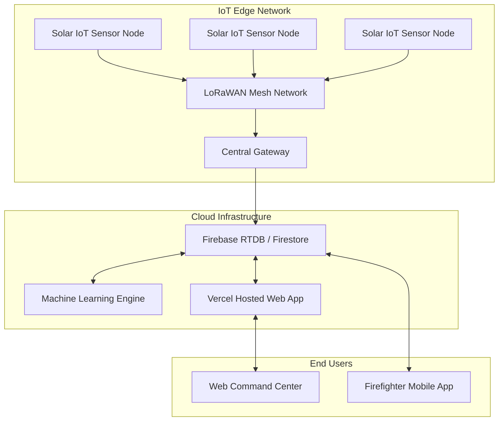

# 🌲🔥 FireSafe – Solar-Powered Long-Range Mesh Network for Forest Fire

We participated in the **Fusion** Hackathon under the **IOT-01 · IOT** track.  
**Team Name**: Akatsuki  
**Team ID**: FUS26-126  
**Problem Statement**: Solar-Powered Long-Range Mesh Network for Forest Fire & Wildland Acoustic Infiltration  

---

## 🚀 Live Links
- **Web Dashboard**: [https://firesafeakatsuki.vercel.app/](https://firesafeakatsuki.vercel.app/)
- **Android App**: [Download FireSafe.apk](https://github.com/shampatil23/FireSafe_Akatsuki/releases/download/v1/FireSafe.apk)

---

## 📖 Problem Statement Analysis
Forest fires cause catastrophic damage to wildlife, ecosystems, and human settlements. Traditional monitoring systems suffer from significant drawbacks:
- **Connectivity Issues**: Deep wildlands lack cellular networks, rendering standard IoT devices useless.
- **Power Constraints**: Remote sensors quickly deplete batteries and cannot be manually serviced often.
- **Late Detection**: Relying on satellite imagery or visual spotting often means fires are detected only after they have spread significantly.

## 💡 Our Solution: FireSafe Ecosystem
FireSafe is a comprehensive, end-to-end forest fire defense ecosystem designed to **predict, detect, alert, and manage** wildfires. 
- **Solar-Powered Mesh Network**: Deploys low-power IoT nodes that communicate over long-range mesh networks (e.g., LoRaWAN) without cellular dependency.
- **Acoustic & Environmental Infiltration**: Sensors capture temperature, humidity, gas levels, and acoustic anomalies to detect early signs of combustion.
- **AI-Powered Risk Analysis**: Real-time telemetry is processed through our machine learning backend to predict fire risks and simulate spread patterns dynamically.
- **Dual-Platform Dashboard**: A web-based command center for administrators/dispatchers and a mobile app for on-ground firefighters/citizens.

---

## 🏗️ System Architecture

---

## 💻 Web Dashboard

The web platform is designed as an Emergency Command Center for operators and administrators.

### 1. 3D Forest Twin & Visualization
Monitors live IoT nodes across the topography in a 3D digital twin. Allows operators to visually identify hotspots before they escalate.

### 2. Risk Analysis & Fire Simulation
AI-powered predictions of fire spread based on current weather, wind speed, and fuel moisture. Helps authorities deploy resources effectively.

### 3. Resource Management & Evacuation
Dynamic mapping of firefighting teams, vehicles, and real-time safe evacuation routes for citizens.

### 4. Operator Dispatch Desk
A centralized hub where operators receive SOS alerts, view real-time sensor telemetry, and dispatch specific firefighters to critical areas based on location and severity.

---

## 📱 Mobile Application Dashboard

The FireSafe Android app provides real-time situational awareness and communication for on-ground personnel and vulnerable citizens.

  
  
  
  
  

- **Home & Telemetry:** Firefighters can view nearby sensor node data, air quality, and risk levels directly on their devices.
- **Live Map Tracking:** Users and officials can track incidents and view safe evacuation routes.
- **Incident Reporting:** On-ground teams can report fire incidents and status back to the main command center.
- **Admin & Command Tools:** Manage emergency resources and dispatch personnel dynamically based on role.
- **Role-Based Access (Fire Police):** Tailored dashboards and features specific to law enforcement and firefighting units.

---

## 📡 Hardware Infrastructure

The backbone of the FireSafe system is the remote IoT sensor mesh. These nodes are designed to survive and operate continuously in deep wildland environments.

  

### Key Hardware Components:
1. **Solar Power & Power Management (BMS)**
   - Equipped with solar panels and high-capacity Li-ion batteries, allowing nodes to operate indefinitely without grid power or manual battery replacements.
2. **LoRaWAN Mesh Transmitter**
   - Transmits telemetry data over long distances (up to 15km) without relying on cellular network coverage. Multiple nodes form a mesh to relay data to a central gateway.
3. **Microcontroller Unit (MCU)**
   - An energy-efficient microcontroller (e.g., ESP32) processes sensor inputs locally to minimize transmission bandwidth and power.
4. **Environmental & Acoustic Sensors**
   - **Temperature & Humidity:** Detects dry, arid conditions that increase fire risk.
   - **Gas Sensors (CO/Smoke):** Detects early combustion products before flames are visible.
   - **Acoustic Sensor:** Constantly monitors audio frequencies to detect anomalies like the crackling of fire or the sound of chainsaws (illegal logging).

---

## 🛠️ Technology Stack
- **Frontend**: HTML5, CSS3 (Glassmorphism), Vanilla JavaScript, Chart.js, Leaflet.js
- **Backend & Realtime Data**: Firebase (Firestore, Realtime DB)
- **Deployment**: Vercel (Web), GitHub Releases (APK)
- **IoT Simulation**: Cellular Automata algorithms for spread prediction

---
